# Axxsolder SDC02 Stand

<table>
  <tr>
    <td>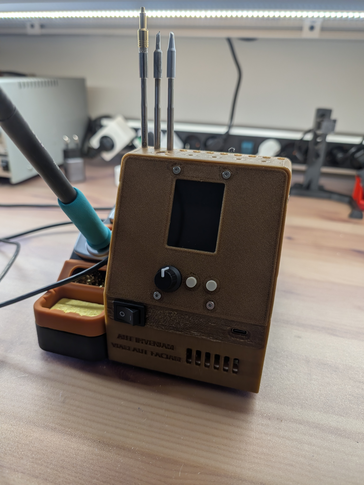</td>
    <td>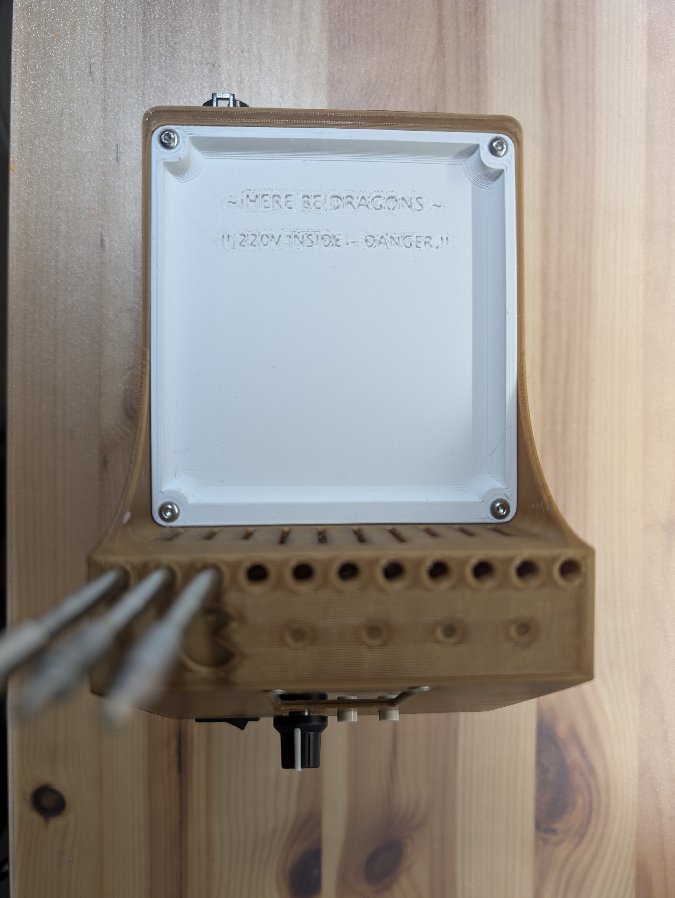</td>
  </tr>
</table>

## Description

This is an enclosure for the [Axxsolder](https://github.com/AxxAxx/AxxSolder/tree/main) soldering iron (v3.5.2) which works with the [Geeboon SDC02](https://aliexpress.com/item/1005008822142566.html) stand.

In order to minimise the amount of clutter and cables, the enclosure integrates not only the Axxsolder electronics but also a MeanWell LRS-150-24 power supply.

The stand includes a handy tray to store soldering wicks or soldering wire, as well as a place on top to store any soldering tips that are not in use.

> **⚠️ Warning:** This project requires you to work with 230V power. **A mistake can potentially create a fire hazard at best or be life-threatening at worst.** If you do not know what you are doing, then please seek the support from a knowledgeable person or do not attempt to do this at all.

## AxxSolder

Axel has done an amazing job putting together an open-source, reasonably priced, high-performance soldering iron that is compatible with the JBC cartridge ecosystem.

You can support the creator of the AxxSolder by purchasing an assembled PCB from his website, [https://www.5dimensions.se/](https://www.5dimensions.se/). Alternatively, you can source the components and the PCB based on the design files provided by Axel at his [github page](https://github.com/AxxAxx/AxxSolder/tree/main).

## 3D Printed Parts

The STL and STEP files can be found in this repository. All parts can be printed without supports, just make sure that your 3D printer has enough cooling to print the long bridge on the base of the stand. Most printers do.

The sample pictures were printed on a Voron/DoomCube 2.4 with the A4T toolhead.

### Suggested Print Settings

- **Material:** PLA (have not tested with others, but ABS/ASA is likely prone to significant warping due to the length of the base)
- **Brim:** on the main body, only if you have warping issues (recommended for ASA/ABS)
- **Perimeters:** 3 or 4
- **Layer height:** 0.2 - 0.3 mm
- **Infill:** 20-30%
- **Top/bottom layers:** 3-5

Note that the design in the pictures is from the prototype version, where the rocker switch was incorporated in the faceplate. As this was very hard to print with good quality (you can see the blistering on the sample pictures), and was tricky to assemble, I have modified the stand to have the rocker switch on the base plate (current version 1.0).

## Tools Required

The following tools are required to build this stand:

- Soldering iron + soldering consumables
- M3 heat insert tip (preferred, but you can use most soldering iron tips)
- Hex keys (size 1.5, 2, 2.5)
- Wire stripper
- Ferrule crimping tool (optional)
- Insulated terminal crimping tool

## Bill of Materials

| Item                                                     | Quantity  | Link                                                                                                              | Comment                                                                                                                                          |
| :------------------------------------------------------- | :-------- | :---------------------------------------------------------------------------------------------------------------- | :----------------------------------------------------------------------------------------------------------------------------------------------- |
| Hirose Connector                                         | 1         | [AliExpress](https://nl.aliexpress.com/item/1005005894421782.html)                                                |                                                                                                                                                  |
| IEC Socket with fuse                                     | 1         | [Mouser](https://eu.mouser.com/ProductDetail/Qualtek/719W-00-04?qs=jRuttqqUwMRju8%2Fk0Jvsog%3D%3D)                | Qualtek 719W-00-04 or equivalent                                                                                                                 |
| LRS-150-24                                               | 1         | [Mouser](https://eu.mouser.com/ProductDetail/MEAN-WELL/LRS-150-24?qs=vDxCgdWo2h%252Bym5KOpEI%252Bpw%3D%3D)        |                                                                                                                                                  |
| Axxsolder PCB                                            | 1         | [GitHub](https://github.com/AxxAxx/AxxSolder?tab=readme-ov-file)                                                  |                                                                                                                                                  |
| Rocker switch                                            | 1         | [Mouser](https://eu.mouser.com/ProductDetail/710-471001264143)                                                    | Wurth 471001264143                                                                                                                               |
| USB-C breakout board (optional)                          | 1         | [Mouser](https://eu.mouser.com/ProductDetail/SparkFun/BOB-15100?qs=0lSvoLzn4L%2Fxowego0yb1A%3D%3D)                | Optional, if you want to use USB-C PD                                                                                                            |
| M3 x 6 mm CSK screws                                     | 4         |                                                                                                                   | Faceplate to base                                                                                                                                |
| M3 x 6 mm CSK screws                                     | 3         |                                                                                                                   | Base to power supply                                                                                                                             |
| M3 x 6 SCHS/SBHS                                         | 2         |                                                                                                                   | Base to USB-C breakout board                                                                                                                     |
| M3 x 12 mm CSK/SBHS                                      | 4         |                                                                                                                   | Tray to base                                                                                                                                     |
| M3 x 12 mm CSK/SBHS                                      | 2         |                                                                                                                   | IEC plug to base                                                                                                                                 |
| M2.5 x 12 mm CSK screws                                  | 4         |                                                                                                                   | Faceplate to Axxsolder PCB                                                                                                                       |
| M2.5 x 8 mm SCHS                                         | 4         |                                                                                                                   | Base to Hirose connector                                                                                                                         |
| M3 x 5 x 4 heatset inserts                               | 10        | [CNC Kitchen](https://cnckitchen.store/products/made-for-voron-gewindeeinsatz-threaded-insert-m3x5x4-100-stk-pcs) |                                                                                                                                                  |
| M2.5 hex nuts                                            | 4         |                                                                                                                   | Faceplate to Axxsolder PCB                                                                                                                       |
| 22 or 24AWG wire                                         | as needed |                                                                                                                   | For the 24V and signal wiring                                                                                                                    |
| 16 or 18 AWG wire                                        | as needed |                                                                                                                   | For the 230V wiring                                                                                                                              |
| Quick connect insulated terminals (for 16 or 18AWG wire) | 5         |                                                                                                                   | For 230V wiring                                                                                                                                  |
| Spade insulated terminals (for all wire gauges)          | 6         |                                                                                                                   | For power supply wiring (230V and 24V)                                                                                                           |
| Ferrules for AWG22 or 24 wires (optional)                | 9         |                                                                                                                   | For 24V and signal wiring connection to Axxsolder terminal block                                                                                 |
| Low-profile right-angle USB cable (optional)             | 1         | [Amazon](https://www.amazon.nl/dp/B08HWKVHMK)                                                                     | To connect Axxsolder USB to USB breakout board                                                                                                   |
| 90 Degree USB-C adapter (optional)                       | 1         | [Amazon](https://www.amazon.nl/dp/B0CNGFZ1JD)                                                                     | To connect Axxsolder USB to USB breakout board. Only necessary if you cannot find a low-profile right-angle cable with less than 13mm thickness. |

**Abbreviations:**

- **SBHS** = Socket Button Head Screw
- **SCHS** = Socket Cap Head Screw
- **CSK** = Counter Sunk Screw

## Preparing the SDC02 Stand

The SDC02 stand needs to be rewired, as in its as-sold configuration it does not support the Axxsolder's sleep features, as it doesn't really follow the same pinout as the more expensive JBC stand.

The first step is to disassemble the stand. This can be done by removing the four rubber feet and unscrewing the 4 underneath screws, plus the screw that is below the label at the bottom of the stand (the label needs to be pierced with the screwdriver).

Once the stand is open, expose the small PCB that we will need to re-wire.

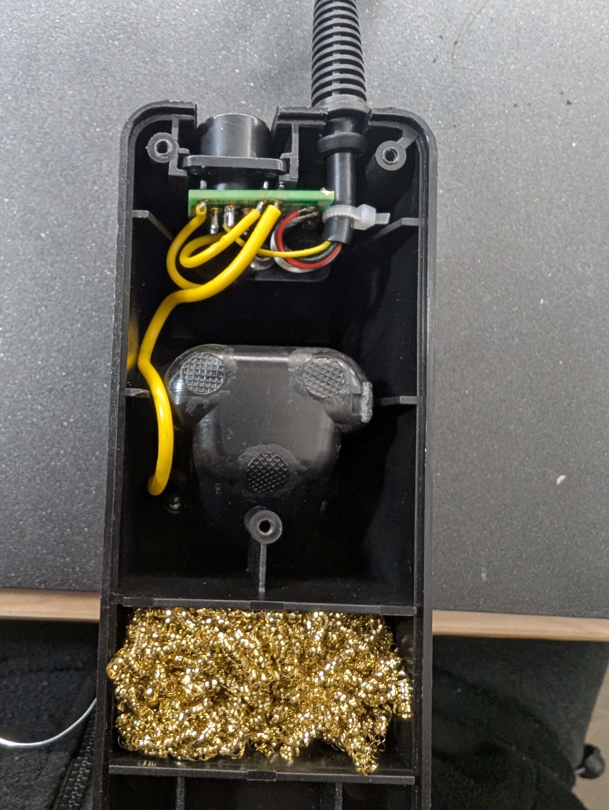

### Original Pinout (As-Sold)

[Thanks to ttelford for figuring this out](https://github.com/AxxAxx/AxxSolder/tree/main/CAD/Alternative_enclosures_and_designs/Geeboon%20Stand)

| AxxSolder Pinout   | SDC02 Stand      | SDC02 Stand Handpiece Output |
| :----------------- | :--------------- | :--------------------------- |
| 1 (Green)          | Green            | 1                            |
| 2 (Red)            | Clear            | 2                            |
| 3 (Handle_sense_2) | Yellow ("sleep") | n/a                          |
| 4 (Stand_Sense)    | Red ("shutdown") | n/a                          |
| 5 (Blue)           | White            | 5                            |
| 6 (Handle_Sense_1) | Black            | 6                            |

### Modifications

Make the following modifications:

1. Desolder the yellow wire from the PCB pad and solder it directly to pin 3 on the Hirose connector.
   - This fixes the handpiece identification.
2. Shunt the "shutdown" and "sleep" nets by soldering a metallic wire between the pad with the red wire and the pad which previously had the yellow wire.
   - Since the Axxsolder does not support shutdown, this modification makes it so that when the tip contacts the tip changer part of the stand, the Axxsolder goes into sleep. This modification is optional if you do not want the sleep on tip change function.

The final result should look like the pictures below:

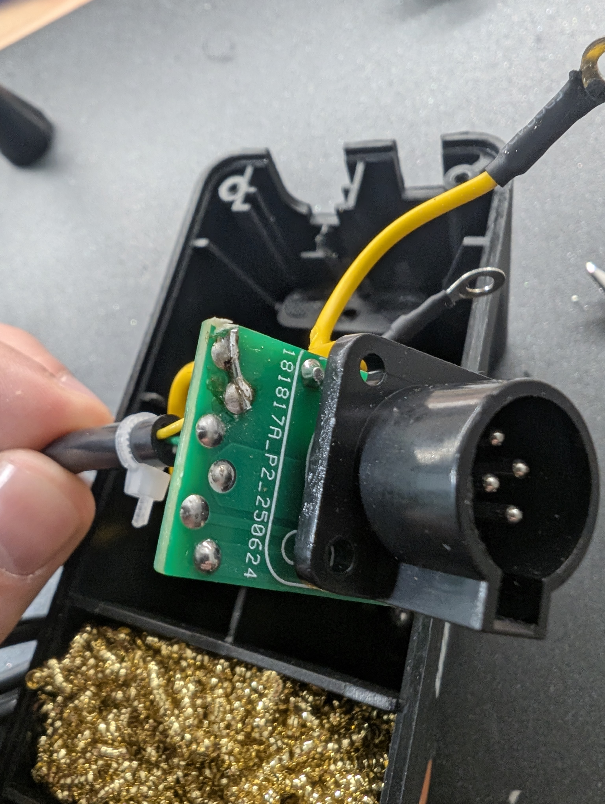
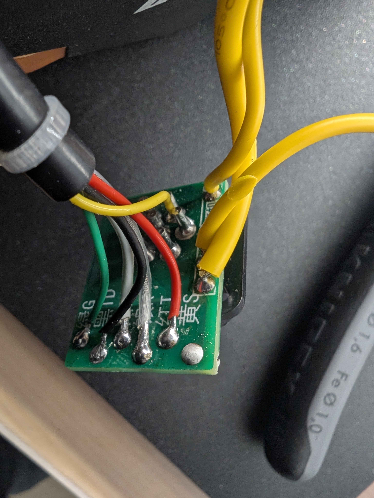

### Final Pinout

| AxxSolder Pinout   | SDC02 Stand               | SDC02 Stand Handpiece Output |
| :----------------- | :------------------------ | :--------------------------- |
| 1 (Green)          | Green                     | 1                            |
| 2 (Red)            | Clear                     | 2                            |
| 3 (Handle_sense_2) | None                      | Handle_Sense (pin 3)         |
| 4 (Stand_Sense)    | Sleep + Shutdown (joined) | 4                            |
| 5 (Blue)           | White                     | 5                            |
| 6 (Handle_Sense_1) | Black                     | 6                            |

Once done, close the SDC02 stand and we can move on to the assembly of the 3D printed stand.

## Preparing the Base

**Before installing the different components**, it's necessary to prepare the base by inserting all the M3 heatset inserts.

Using a soldering iron at 190°C, insert the 10 heatset inserts into the different locations in the stand (shown below).

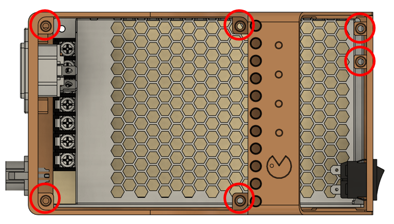
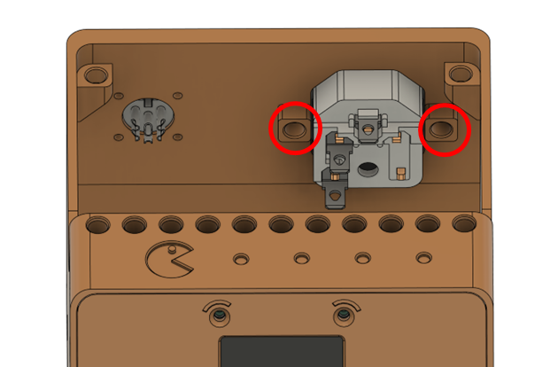
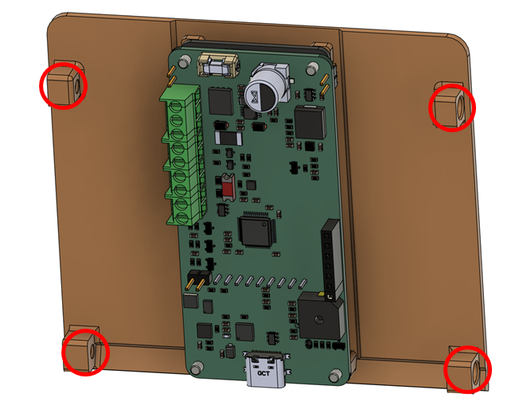

## Wiring Diagram

The wiring of the stand is shown in the diagram below.

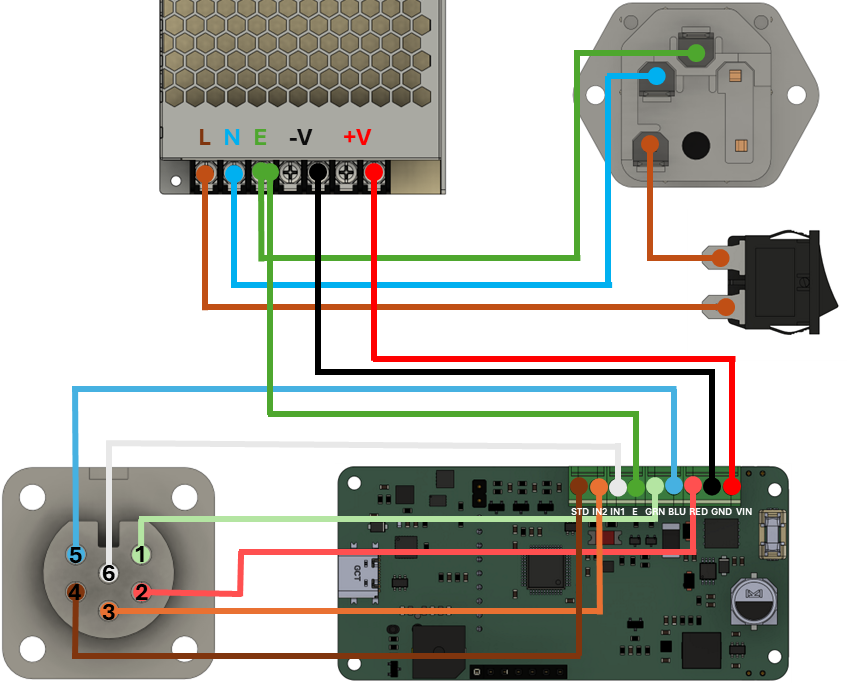

### Important Notes

- It is recommended to use ferrules to connect the wires to the Axxsolder terminal blocks.
- It is mandatory to use proper insulated terminals for the 230V wiring! Never clamp just the wire to the PSU or to the IEC plug/rocker switch, and do not attempt to solder to the plug/switch unless you know exactly what you are doing. Any mistakes can result in injury or fire.
- Make sure all 230V connections are properly secured before switching anything on.
- Earth connection should be provided to the Axxsolder, but it is optional.

## Installing the 24V PSU

Connect all the necessary harness to the PSU terminals, and then slide the PSU in through the back opening of the stand.

### PSU Terminal Connections

| PSU Terminal | Wire                                   | Color (recommended)    |
| :----------- | :------------------------------------- | :--------------------- |
| V+           | 24V to AxxSolder                       | Red                    |
| V-           | GND to AxxSolder                       | Black                  |
| Earth        | Earth to AxxSolder + Earth to IEC plug | Green and Green/Yellow |
| L            | Line to Rocker Switch                  | Brown                  |
| N            | Neutral to IEC Plug                    | Blue                   |

Make sure to verify that the connections are properly done and will not come out easily. **Any loose cables could create a safety hazard!**

Secure the PSU with **3 M3 x 6 mm CSK screws**, installed from the left side of the stand.

## Installing the Hirose Connector

The wiring of the Hirose connector should be done following the pinout of the SDC02 stand. See the picture below for the expected result.

| Hirose Connector Pin Number | Axxsolder Pin  | Wire Color (in picture above) |
| :-------------------------- | :------------- | :---------------------------- |
| 1                           | Green          | Green                         |
| 2                           | Red            | Red                           |
| 3                           | Handle_Sense_2 | Orange                        |
| 4                           | Stand_Sense    | Brown                         |
| 5                           | Blue           | Blue                          |
| 6                           | Handle_Sense_1 | White                         |

Once the wires have been soldered, install the connector on the stand using **4 M2.5 x 8 mm SCHS**. As the screws are threading into plastic, be careful not to overtighten them.

If you do overtighten them, simply install longer screws and use M2.5 nuts.

## Installing the IEC Plug

Slide in the IEC plug and secure it with **2 M3 x 12 mm CSK/SBHS screws** to the stand.

Then, wire the IEC plug as shown below.

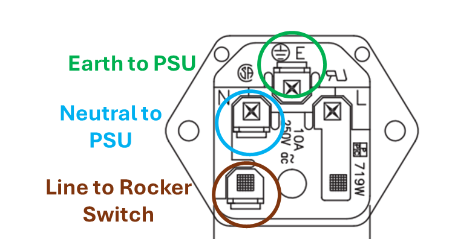
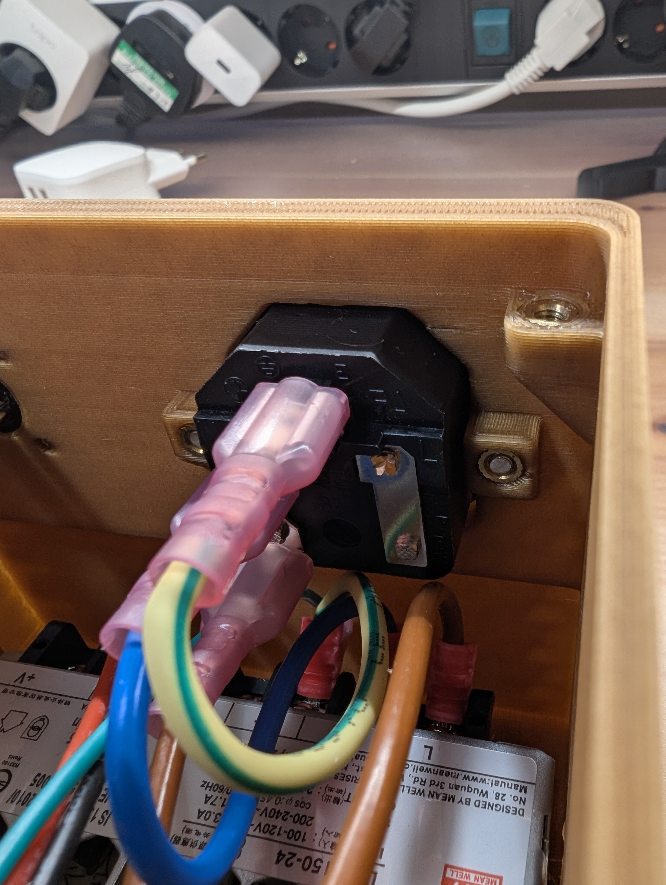

Make sure to verify that the connections are properly done and will not come out easily. **Any loose cables could create a safety hazard!**

At this point the assembly should look roughly like the pictures below.

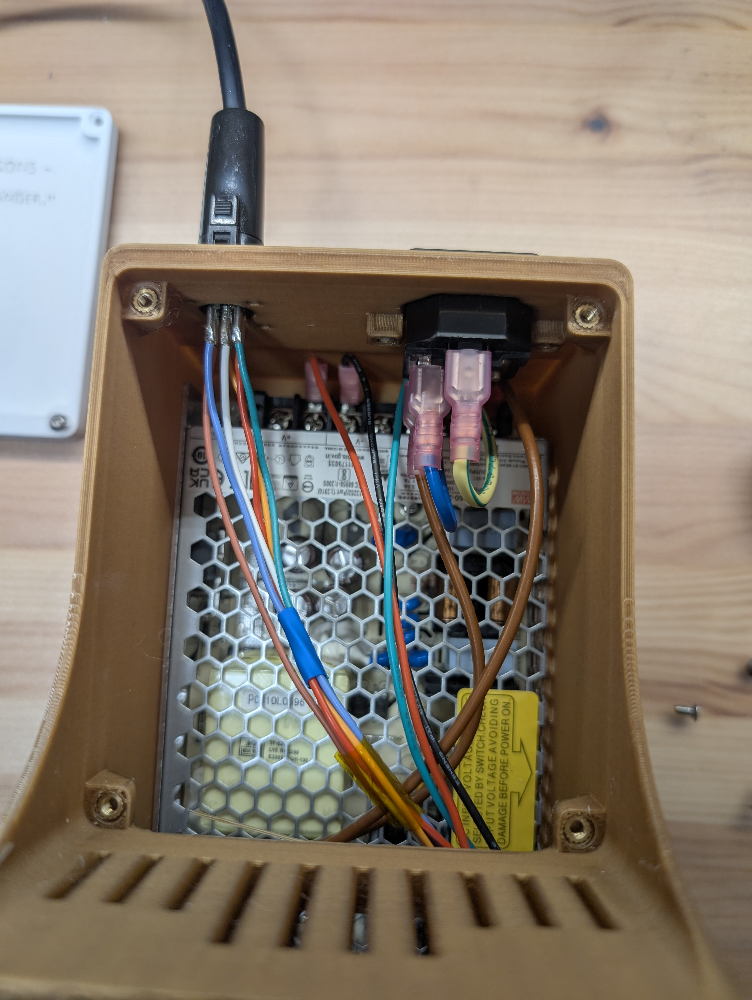
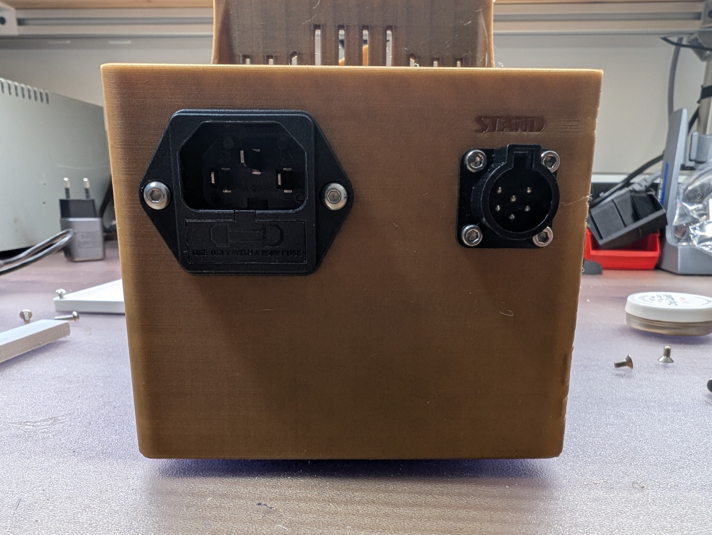
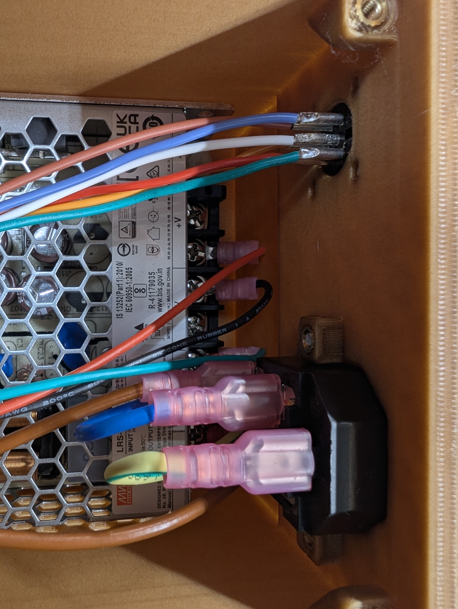

## Installing the Rocker Switch

Install the rocker switch on the stand by pressing it in from the outside until it clicks into place. Verify that it is not loose.

Once done, **connect the two Line (brown wires) coming from the IEC plug and the 24V PSU to the rocker switch.**

As the switch is simply on/off, it does not matter which wire goes in which pin.

> **⚠️ Important:** Do not connect using the Neutral (blue wire)!! If for some reason there is a failure of the insulation on the switch, this could be dangerous.

## (Optional) Installing the USB-C Breakout

There is space in the stand to install a USB-C breakout board, which can then be connected to the Axxsolder via a USB-C cable.

This enables:

- Easier firmware updates, as you do not have to disassemble the lid to connect the USB cable to the AxxSolder directly.

I am using a USB-C breakout board as that is what I had available and I did not want to spend more funds on this project. There are simpler solutions, such as panel-mounted USB-C modules that come already with the cable, but you will need to modify the CAD to fit those (should be very simple).

If you do not need this capability, keep it simple and skip this step.

The USB-C does not work for power delivery (yet), as the breakout board I am using only supports 5V 1.5A connections, and the AxxSolder needs 19-24V. This is for the next version.

### Step 1 - Prepare the Cable

Find a short (10-15cm), low-profile (< 13mm) right-angle cable that will fit in the space between the AxxSolder and the stand.

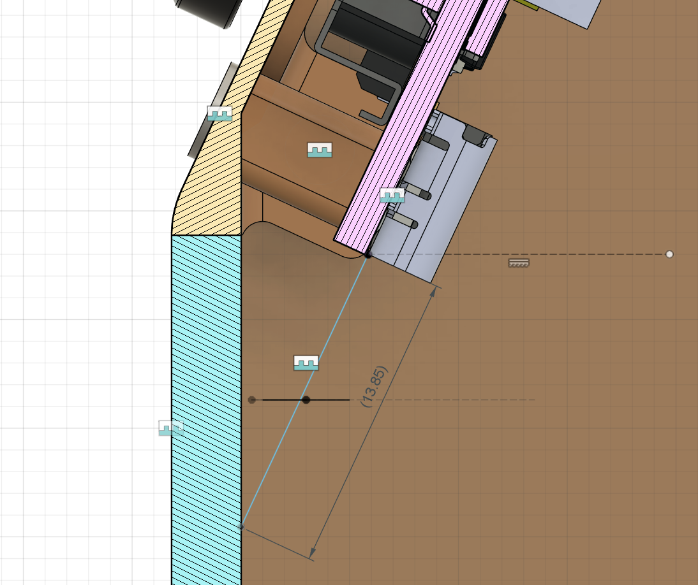

I have placed a suggestion in the BOM. If you cannot find such a cable, another option is using a 90-degree USB-C adapter and then using a regular cable.

Cut the cable to the right length and strip one end of it, then solder the wires to the breakout board as per the USB-C standard pinout.

### Step 2 - Install the USB-C Breakout Board

Install the USB-C board to the stand by using **2 M3 x 6 SCHS/SBHS screws**.

### Step 3 - Connect the Cable to the AxxSolder

Connect the USB-C cable to the AxxSolder.

## Installing the Axxsolder

Now that the base is wired, the last step is to install the Axxsolder PCB and complete the connections for the stand.

Prior to the installation of the AxxSolder, ensure that the firmware has already been flashed, either via USB or via the STLink Programmer. For more information, check the [Axxsolder readme](https://github.com/AxxAxx/AxxSolder).

To begin with, install the AxxSolder PCB to the faceplate with **4 M2.5 x 12 mm CSK screws and 4 M2.5 nuts**. Do not overtighten to prevent damage.

Then, cut the wires coming from the Hirose connector and from the PSU, strip them and optionally crimp them with ferrules (recommended).

### Axxsolder Terminal Connections

| AxxSolder Pin | Wire Origin  | Wire Color |
| :------------ | :----------- | :--------- |
| VIN           | PSU V+       | Red        |
| GND           | PSU V-       | Black      |
| RED           | Hirose Pin 2 | Red        |
| BLU           | Hirose Pin 5 | Blue       |
| GRN           | Hirose Pin 1 | Green      |
| EARTH         | PSU EARTH    | Green      |
| IN1           | Hirose Pin 6 | White      |
| IN2           | Hirose Pin 3 | Orange     |
| STAND         | Hirose Pin 4 | Brown      |

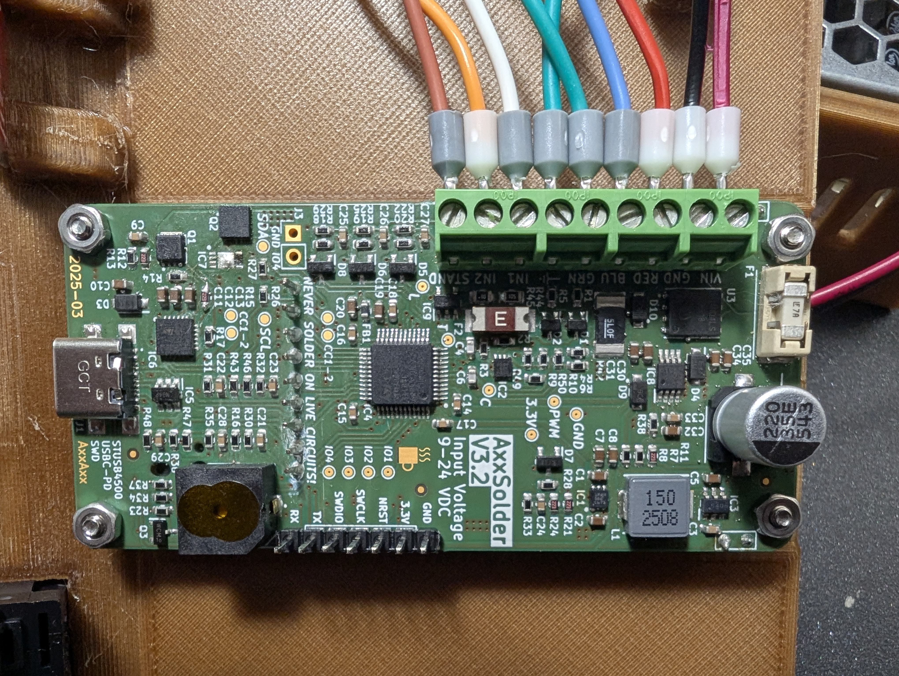

Next, install the faceplate on the stand using the **4 M3 x 6 mm CSK screws**, to be installed from the side of the stand.

Finally, install the encoder and button caps.

## Installing the Tray

The final step is to install the tray. This can be done with **4 M3 x 12 mm CSK/SBHS screws**.

This tray has two functions:

1. It allows you to store solder, soldering wick, etc, on top of the stand for easy access.
2. It provides easy access to the wiring in case of need, for inspection or modifications, all while preventing users from touching the 230V wiring during operation.

**⚠️ Safety Warning:** For your safety, **NEVER open the tray while the AxxSolder is plugged in to the MAINS!!**

**This completes the assembly of the AxxSolder SDC02 stand with integrated PSU.**

<table>
  <tr>
    <td></td>
    <td></td>
  </tr>
</table>

## TODO

- [ ] Change USB design to enable USB-C power delivery to be able to take the stand on-the-go with a compatible power bank. Need to find or make a proper USB-C PD break-out board.

## License

Please refer to the [Axxsolder repository](https://github.com/AxxAxx/AxxSolder) for licensing information relevant to the Axxsolder itself.

This hardware enclosure is licensed under the Creative Commons Attribution-NonCommercial-ShareAlike 4.0 International (CC BY-NC-SA 4.0) license.

To view a copy of this license, visit: http://creativecommons.org/licenses/by-nc-sa/4.0/

Please note that while the [Axxsolder](https://github.com/AxxAxx/AxxSolder) is licensed under the GNU General Public License (GPL) v3.0, this case is an independent, original mechanical design and is licensed separately as stated above, while respecting the share-alike and attribution requirements of the GPL.

## Credits

- Axxsolder design by [AxxAxx](https://github.com/AxxAxx/AxxSolder)
- SDC02 stand pinout figured out by [ttelford](https://github.com/AxxAxx/AxxSolder/tree/main/CAD/Alternative_enclosures_and_designs/Geeboon%20Stand)
